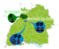

<p float="left">
     
</p>

# MPVBench

**Contact**: [goekhan.demirel@kit.edu](mailto:goekhan.demirel@kit.edu)

This **MPVBench** repository provides supplementary materials for the paper [Impact and Integration of Mini Photovoltaic Systems on Electric Power Distribution Grids](https://link.springer.com/chapter/10.1007/978-3-031-74741-0_16).

## Introduction


The **MPVBench** repository provides open-source, real-time measured data from five Mini Photovoltaic (MPV) or Balcony Power Plants systems located in Karlsruhe and Pforzheim.

---
## Data Types
The repository provides data on 15-minute power production (W) and temperature (K) and is updated monthly.

**⚠️ Note**: **Last update was on 13.11.2024**.

## Repository Structure
```plaintext
MPVBench/
├── data/
│   ├── img/
│   ├── 00_ka_mpv_metadata.md
│   ├── 00_pf_mpv_metadata.md
│   ├── 01a_mpv_metadata.md
│   ├── 01b_mpv_metadata.md
│   ├── 01c_mpv_metadata.md
│   ├── 02a_mpv_metadata.md
│   ├── 02b_mpv_metadata.md
│   ├── p_watt.csv
│   └── t_celsius.csv
├── LICENSE
├── MPVBench_Tutorial.ipynb
├── README.md
└── requirements.txt
```

The structure of the repository is as follows:
  - CSV data files (e.g., [p_watt.csv](data/p_watt.csv), [t_celsius.csv](data/t_celsius.csv)).
  - Metadata files for technical specifications (e.g., [01a_mpv_metadata.md](data/01a_mpv_metadata.md)).
  - Jupyter notebooks for tutorial ([MPVBench_Tutorial.ipynb](MPVBench_Tutorial.ipynb)).




---

## How to Use
1. Clone the repository:
   ```bash
   git clone git@github.com:KIT-IAI/MPVBench.git
   pip install -r requirements.txt
   ```

## License
This code is licensed under the [MIT License](LICENSE).

## Citation <a name="citation"></a>
<!-- If you use this framework or our results in your research, please cite our [paper](https://will be published): -->
If you use this framework in a scientific publication, please cite the corresponding paper:

#### BibTeX format
```tex
@InProceedings{Demirel_MPV_2024,
    author = {Demirel, Gökhan and Grafenhorst, Simon and Förderer, Kevin and Hagenmeyer, Veit},
    editor = {Jørgensen, Bo Nørregaard and Ma, Zheng Grace and Wijaya, Fransisco Danang and Irnawan, Roni and Sarjiya, Sarjiya},
    title = {Impact and Integration of Mini Photovoltaic Systems on Electric Power Distribution Grids},
    booktitle = {Energy Informatics},
    year = {2025},
    publisher = {Springer Nature Switzerland},
    address = {Switzerland Cham},
    pages = {247--265},
    isbn = {978-3-031-74741-0}
}
```

## Contact
For any questions or inquiries, please contact goekhan.demirel@kit.edu.
